---
title: "ClickHouse on Pandas DataFrame"
date: 2024-08-15T15:36:19+08:00
draft: false

---


# ClickHouse on DataFrame

## To be the Fastest SQL Engine on Any Format

The story begins with the undeniable fact that ClickHouse is the fastest open-source OLAP engine on the planet. Even when your data outgrows your memory capacity, it can still process it at lightning speed with incredible memory efficiency. Every challenger in this field tries to prove they are faster and easier to use than ClickHouse. However, the unique nature of databases means that five years might just be a warm-up, and it takes a decade to truly master the craft. After all, no one wants to face a situation where their data is unreadable due to unforeseen issues, nor can anyone afford any errors in data computation results.

A database is like a baby that needs careful nurturing. We are willing to use the best CPUs, the largest memory, and the fastest hard drives to ensure our production databases run stably, quickly, and reliably. The developers of ClickHouse have been continuously refining and optimizing it with a spirit of excellence for 15 years. Some say it’s the evergreen in the open-source OLAP track; I prefer to think of it as a powerful engine. Traditionally, if you wanted to harness such an engine, you’d need to buy a supercar and meticulously maintain and fine-tune it—just like purchasing a few professional servers, carefully installing database daemons, and hiring several OPS & DBAs skilled in database tuning, high availability, and data backup.

But what if all you have is a laptop, and you don’t want to install a daemon on it? Yes! You’ve got **clickhouse-local** and **chDB**. If you want to integrate the ClickHouse engine into your app, you must try **chDB**. With chDB’s UDFs and UDTFs, you can seamlessly incorporate your business logic into the ClickHouse engine!

### 80+ Formats

CSV, JSON, Parquet, ORC, SQL dumps, SQLite, MySQL Server, PostgreSQL Server, and even another ClickHouse Server can all be easily treated as tables in chDB, allowing you to perform complex SQL queries with almost no data movement.

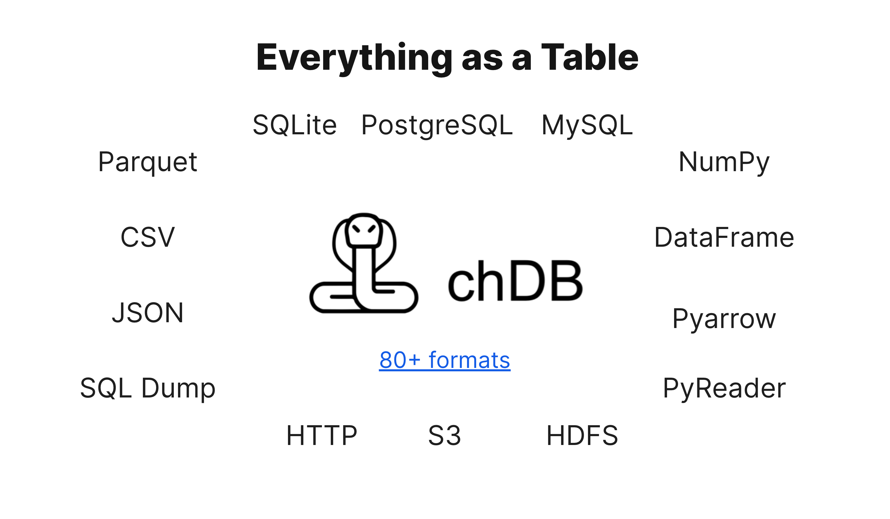

Building on clickhouse-local’s existing support for Query on File and Query on Stream, chDB achieves nearly zero performance loss. However, as an in-process engine, how does chDB handle in-process data? We know that clickhouse-local currently only supports Block or Stream types of data as input or output. In other words, because clickhouse-local is a standalone binary file, all input and output need to be done through file descriptors (fd).

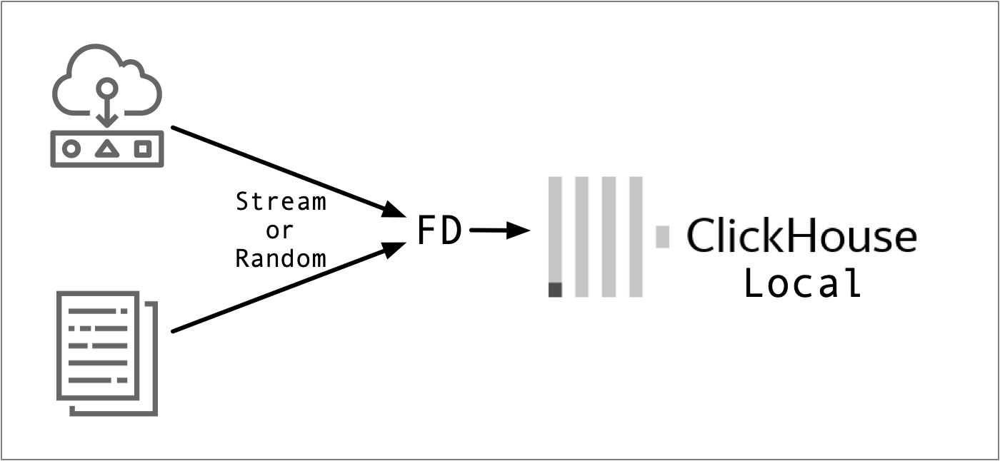

But in-process engines often deal with in-memory data read or generated by libraries like Pandas, Numpy, or PyArrow. To perform efficient SQL queries on this data, you need to achieve at least the following:

1. Zero-copy, or more rigorously, Minimum Copy
2. Fine-grained reading (considering CPU and memory hardware characteristics, while fully utilizing existing statistics)

The initial version of chDB was designed with simplicity in mind, providing a usable implementation. For handling in-memory data, taking Pandas DataFrame as an example, the initial version of chDB Query DataFrame was implemented as follows:

1. Serialize the in-memory DataFrame to Parquet (actual tests showed that Parquet is faster as an intermediate format than Arrow Buffer).
2. Write the Parquet to a temporary file or [memfd](https://man7.org/linux/man-pages/man2/memfd_create.2.html).
3. Modify the data source Table in the SQL statement to replace it with ClickHouse’s File Table engine and pass in the fd of the temporary file.
4. Run the ClickHouse Engine, setting the output format to Parquet.
5. Read the Parquet Buffer and convert it into a DataFrame.

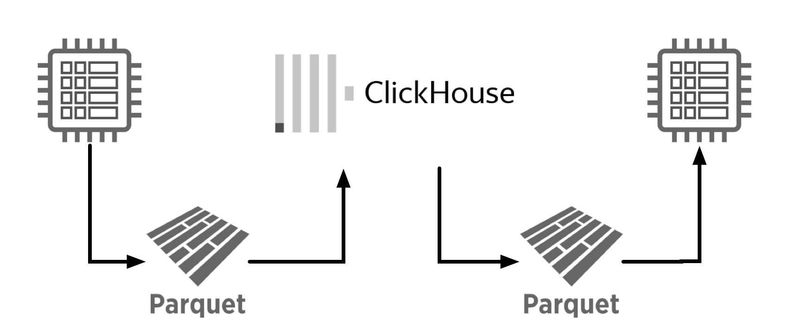

The result of this implementation was that most of the time was wasted on serialization & deserialization and memory copying. Even with the use of [memfd](https://man7.org/linux/man-pages/man2/memfd_create.2.html), performance was still unsatisfactory.

As shown in the chart below, because most of the time was wasted, almost every query in chDB took over 30 seconds.

**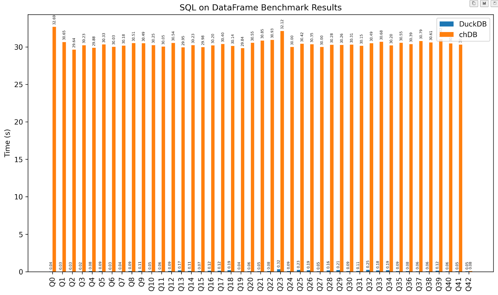**

### DataFrame as a Table

In March 2024, as chDB joined the ClickHouse family, we prioritized support for Python Data Science in chDB. Therefore, support for reading and writing Pandas DataFrame, Numpy Array, and PyArrow Table was added to the Roadmap.

In June 2024, chDB v2 introduced SQL on DataFrame, allowing you to easily run SQL on a DataFrame variable `df` as a table, like this:

```
import chdb

df = pd.DataFrame({"a": [1, 2, 3], "b": ["one", "two", "three"]})
chdb.query("SELECT * FROM Python(df)").show()
```

Numpy Array, PyArrow Table, and Python Dict variables can also be queried as tables in a similar manner:

```
import chdb
import pandas as pd
import pyarrow as pa

data = {
    "a": [1, 2, 3, 4, 5, 6],
    "b": ["tom", "jerry", "auxten", "tom", "jerry", "auxten"],
}
chdb.query("SELECT b, sum(a) FROM Python(data) GROUP BY b").show()

arrow_table = pa.table(data)
chdb.query("SELECT b, sum(a) FROM Python(arrow_table) GROUP BY b").show()
```

However, this approach still may not cover the diverse and complex Python data querying needs. Therefore, I began considering creating a mechanism that allows users to define their own table-returning logic. This way, chDB users can combine Python’s flexibility with ClickHouse’s high performance to do many interesting things. Let me keep that under wraps for now and first share how we made chDB the fastest SQL on DataFrame engine in the world, one line at a time. 😉

## How We Made It

If you want to show off your skills, use C++: complex abstractions, low-level operations, and enough historical baggage can drive anyone reading your code crazy. But none of this happened with ClickHouse, a behemoth of 1.06 million lines of C++ code. Well-chosen abstractions, clear data processing logic, and a comprehensive logging system made adding the TableFunctionPython to the ClickHouse engine a delightful process.

The process was divided into three steps, none of which involved any complex C++ logic:

1. Declare and register the [TableFunctionPython](https://github.com/chdb-io/chdb/blob/main/src/TableFunctions/TableFunctionPython.cpp#L133).
2. Define the logic for [StoragePython](https://github.com/chdb-io/chdb/blob/main/src/Storages/StoragePython.h#L142), mainly focusing on how to read data and obtain the table schema.
3. Define the logic for [PythonSource](https://github.com/chdb-io/chdb/blob/main/src/Processors/Sources/PythonSource.h#L24), mainly focusing on how to return data blocks for the concurrent pipeline.

First, we need to declare and register a [TableFunctionPython](https://github.com/chdb-io/chdb/blob/main/src/TableFunctions/TableFunctionPython.cpp#L133). This way, after ClickHouse’s parser parses the SQL into an AST, it knows there is a table engine called `Python`:

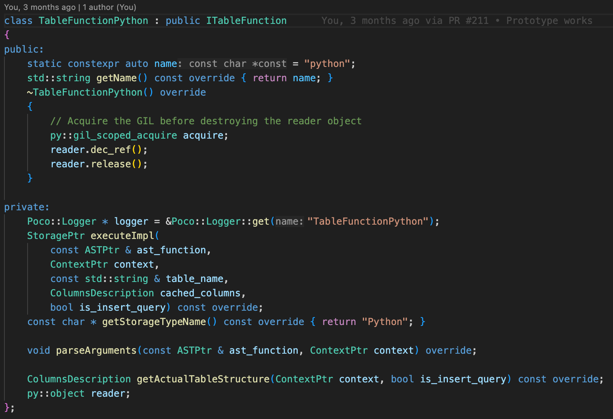

The registration process is also very straightforward, mainly involving providing necessary descriptions and examples, then declaring that "Python" is case-insensitive:

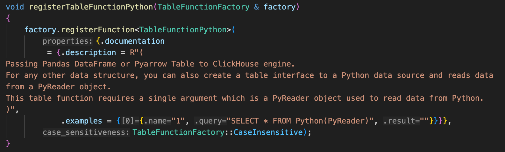

The main function of the StoragePython class is actually to be part of ClickHouse’s data pipeline, with most of the data processing happening in the PythonSource class below. If you’re interested in the history of ClickHouse, in earlier versions, the `IStorage.read` function was responsible for actual data processing. However, it is now part of the physical execution plan.

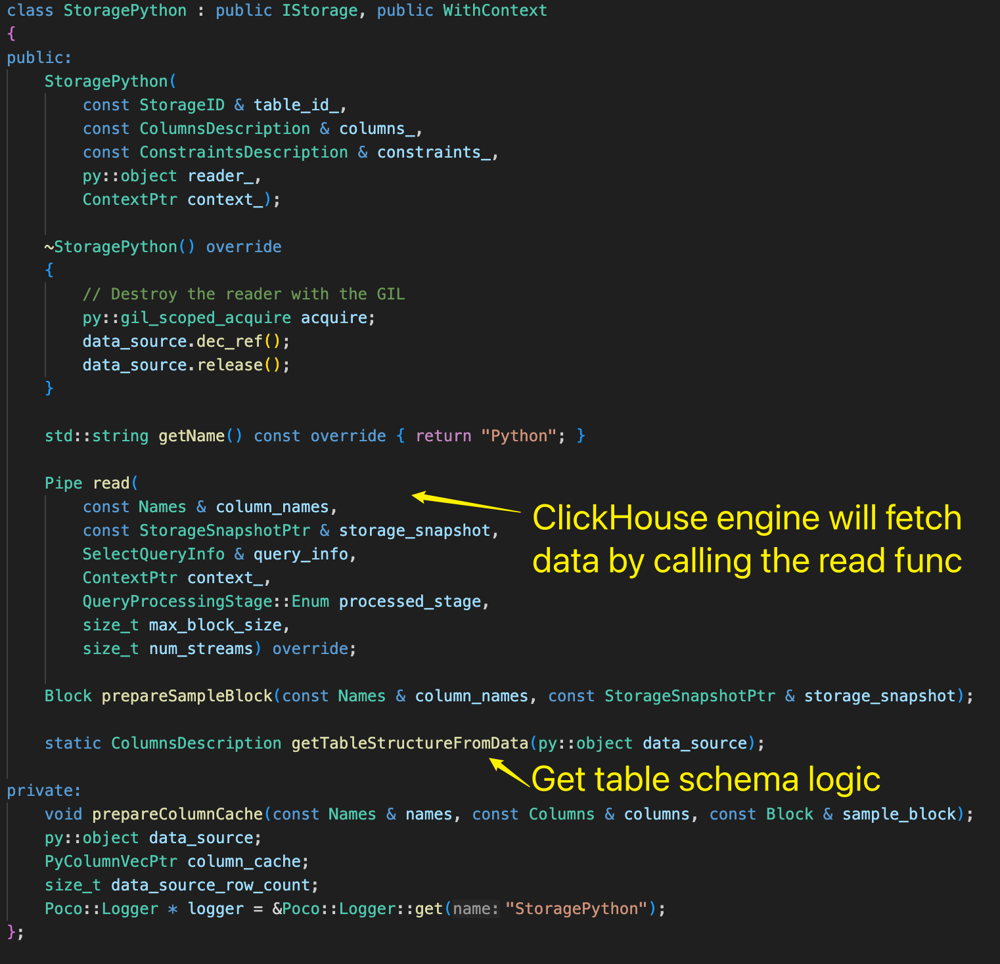

PythonSource inherits from ISource, and ISource.generate is responsible for data generation once the pipeline starts running.

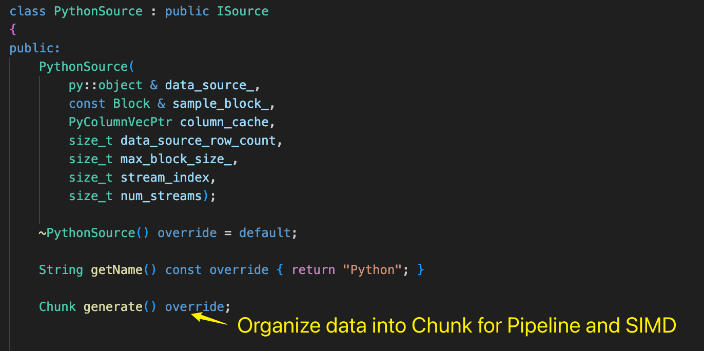

## Some Troubles

Although the overall code framework of the chDB Python Table Engine is relatively simple, we did encounter many unforeseen issues along the way. Most of the problems arose from performance issues when interacting between C++ and Python.

For example, when reading in-memory Pandas DataFrames in chDB, it is inevitable to call parts of CPython (the C implementation of Python, which is also the mainstream Python implementation). This leads to two significant challenges: the GIL and Object Reference Counting.

### Fly with GIL

Due to the existence of the Python GIL (Global Interpreter Lock), any CPython function call requires acquiring the GIL first. If the GIL’s granularity is too large, it will directly cause ClickHouse’s multi-threaded engine to degrade into serial execution under the GIL’s constraints; if the GIL granularity is too small, frequent lock contention between threads will occur, which in some cases might even make the execution slower than a single-threaded program.

> In CPython, the **global interpreter lock**, or **GIL**, is a mutex that protects access to Python objects, preventing multiple threads from executing Python bytecodes at once. The GIL prevents race conditions and ensures thread safety. A nice explanation of [how the Python GIL helps in these areas can be found here](https://python.land/python-concurrency/the-python-gil). In short, this mutex is necessary mainly because CPython's memory management is not thread-safe.
>
> From: https://wiki.python.org/moin/GlobalInterpreterLock

### Avoid Ref Counting

Python is a language with automatic garbage collection, making it very easy to write code in Python. However, if you accidentally reference an existing Python object in memory or create a new Python object, you must control the reference counter; otherwise, it may lead to double-free errors or memory leaks.

Therefore, for chDB, the only viable approach is to avoid calling CPython API functions to read CPython objects as much as possible. Does this sound crazy?!

Let me briefly explain what we did to make ClickHouse engine still one of the fastest SQL engines on Pandas DataFrame despite Python dragging its feet.

## Performance Optimizations

Initially, our starting point was the chDB v1, which required at least four extra serialization and deserialization steps: almost every query took over 30 seconds.

Then we implemented a new version of chDB that directly reads Python objects. For the most time-consuming Q23 query, the time was reduced by nearly four times to 8.6 seconds.

> Q23: SELECT * FROM hits WHERE URL LIKE '%google%' ORDER BY EventTime LIMIT 10;

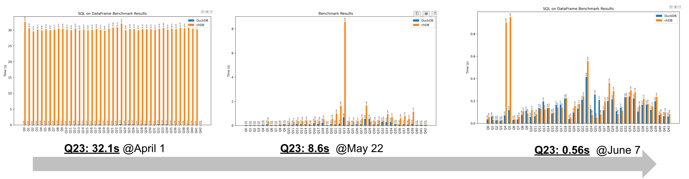

Through continuous optimization and exploration of how to maintain ClickHouse’s performance despite the presence of Python’s GIL and GC, we primarily did the following three things:

1. Minimized the number of CPython API function calls. When unavoidable, we handled them in a concentrated manner to avoid calling any CPython functions after the pipeline construction was complete and started running.
2. Batched data copying as much as possible, utilizing ClickHouse’s SIMD-optimized memcpy.
3. Rewrote the Python string encoding and decoding logic in C++.

The last point might be a bit hard to understand, so let me elaborate:

### Python String Encoding

Due to historical reasons, the data structure of Python’s str is extremely complex. It could be stored in UTF-8, UTF-16, UTF-32, or even more obscure encodings. When users further manipulate the str, Python’s runtime may convert them all to UTF-8 encoding and possibly cache them in the str structure.

This results in a lot of cases to handle, and as mentioned before, any call to a CPython function requires acquiring the GIL first. This means that if you use Python’s internal implementation for the conversion to UTF-8, only one thread can work at a time. So, out of necessity, we re-implemented the str encoding conversion logic in C++.

Our efforts directly led to another significant performance leap for Q23, reducing the time from 8.6 seconds to 0.56 seconds—a 15-fold improvement! 🚀🚀🚀

As of August 14, 2024, thanks to our tireless efforts, chDB has surpassed DuckDB in terms of overall execution time and the number of faster queries on a DataFrame generated from 10 million rows of ClickBench data:

> DuckDB better count: 19
>
> chDB better count: 24
>
> DuckDB total time: 6.52
>
> chDB total time: 5.80

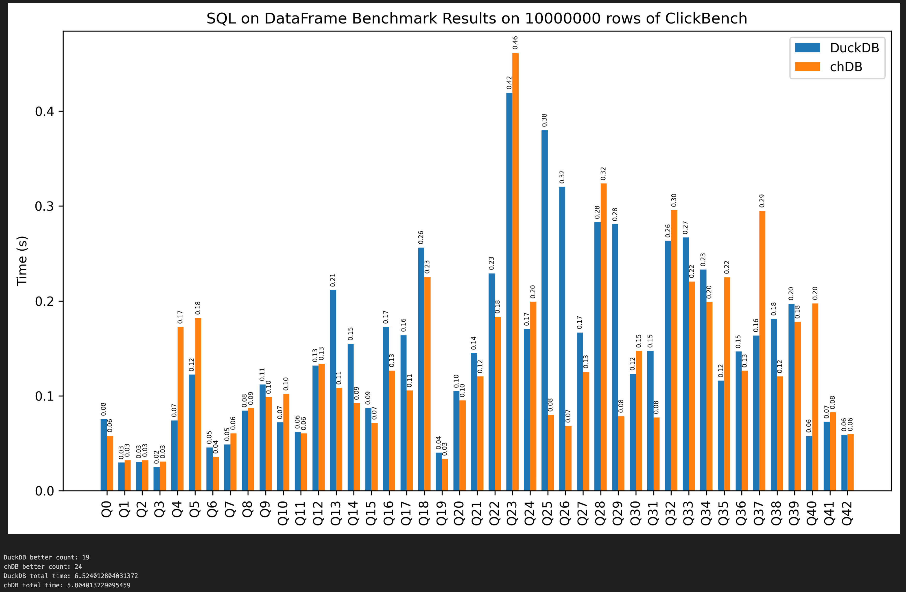

Note:

1. The above benchmark data was tested on hardware with EPYC 9654 + 128G + HP FX900 4TB NVMe, using 30 million rows of [ClickBench](https://github.com/ClickHouse/ClickBench?tab=readme-ov-file#data-loading) data. The related code: [pd_zerocopy.ipynb](https://github.com/chdb-io/chdb/blob/readPyObj/tests/pd_zerocopy.ipynb).

Of course, for a database, performance isn’t everything. chDB v2’s 87-fold performance improvement isn’t the only exciting feature; the seamless combination of Python’s flexibility and ClickHouse’s high performance in the User Defined Python Table Function is what excites me the most.

## User Defined Python Table Function

After several weeks of development, we now have `chdb.PyReader`. You only need to inherit this class and implement the read function to use Python to define the data returned by a ClickHouse Table Function. Like this:

```
import chdb

class MyReader(chdb.PyReader):
    def __init__(self, data):
        # some basic init

    def read(self, col_names, count):
        # return col_names*count block

# Initialize reader with sample data
reader = MyReader({
    "a": [1, 2, 3, 4, 5, 6],
    "b": ["tom", "jerry", "auxten", "tom", "jerry", "auxten"],
})

# Execute a query on the Python reader and display results
chdb.query("SELECT b, sum(a) FROM Python('reader') GROUP BY b").show()
```

### SQL on API

With chdb.PyReader, you can define your own data return logic using Python. So I made a [demo for querying Google Calendar using SQL](https://github.com/auxten/SQL-On-Everything/tree/main/google-calendar). By running:

```
python google_cal.py \
  "SELECT summary, organizer_email, parseDateTimeBestEffortOrNull(start_dateTime) WHERE status = 'confirmed';"
```

You can retrieve all your accepted meeting invitations:

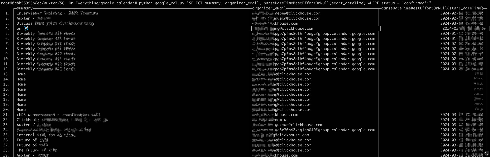

Through the API provided by chDB, you can easily treat many APIs that return JSON arrays as a ClickHouse table to run SQL queries. You don’t need to store any additional data or manually define any table structures.

All the above features are available in [chDB v2.0.0b1](https://github.com/chdb-io/chdb/releases/tag/v2.0.0b1) and later versions. If you're interested in building your own applications with chDB, we welcome you to join our [Discord](https://discord.gg/D2Daa2fM5K). And don't forget to give [chDB](https://github.com/chdb-io/chdb) a Star.

Everything you need:

> pip install chdb>=2.0.0