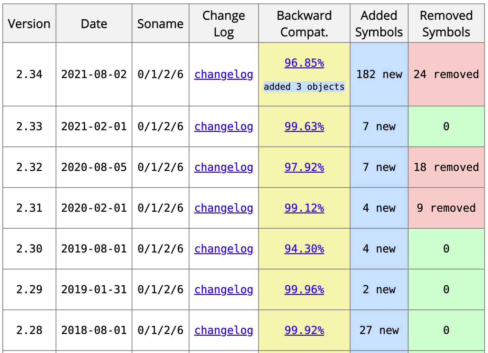

---
title: "How I made Apache Superset a macOS App"
date: 2022-05-30T15:36:19+08:00
draft: false

---


I’m a heavy user and also a code contributor to Apache Superset. Running Superset on my MacBook is the only reason to have a Docker(still a VM inside?) installed which I think is too heavy.

Superset puts most heavy work onto the database side, I was thinking is there may be some possibility to have a `Superset.app` to make it easier to use Superset on my MacBook.

My technical stack is mainly backend, some keywords like:

> *Python, Golang, C, Backend*

I have absolutely no experience with Objective-C or Swift and don’t even understand how a macOS App and a UNIX executable are related. But it still deserves a try.

## Packaging

Superset is a Python + React project, to avoiding introduce a new stack I think using Python to develop the UI part might be easy. For the backend, everyone using Python knows that the packaging is a really complex problem. Especially with Python packages including dynamically linked shared libraries(*.dylib or *.so).

Some people may say what about using `pip freeze` to generate a `requirement.txt` and install them on the first launch. Well, there may be mainly 2 problems:

1. It will break the convention of “Dragging into Trash means Uninstall”.
2. The user’s Python environment may also be polluted and cause various problems.

After some Googling, I found there are mainly 3 tools I can use to do the packaging:

1. PyInstaller (9.2k stars, Windows/Linux/macOS)
2. cx_Freeze (905 stars, Windows/Linux/macOS)
3. Py2app (189 stars, macOS only but actively developing)

PyInstaller is a pretty old project, a lot of Python-based Windows programs are built with it and also with the 9.2k stars. Typically the most “stared” tool is the best choice, but not this time.

As far as I know, there is no silver bullet to solve these `*.dylib` packaging problems. Most of the packaging tools have to keep a bunch of recipes to solve the tricky libs. Superset introduces a lot of database drivers which are hard to deal with. With years of experience solving the `*.so` problems, I need a relatively simple tool in case of hacking is needed. So my decision is to give py2app a try.


### Dynamic Libs

I am quite suffered from the Linux dynamic lineage problems. Linux kernel ABI is quite stable, and glibc handles the ABI very carefully. 




Even libs like OpenSSL tried their best to keep a stable ABI.

<!--img src="image-20220526001558775.png" alt="OpenSSL ABI history" title="" style="zoom:36%;" /-->


But the upper level libs shipped with different Linux distributions, pkg management systems constructed a matrix. 

When it comes to macOS, most libs shipped with system are quite stable and things in Linux like `libc`, `libc++`, `libpthread`, `libm` are merged into `libSystem.B.dylib`.

Although, the `ps` command in macOS is not GNU version, but you can still see the big difference of dependent libs of `/bin/ps` between CentOS 8.1` and `macOS 12.3.

<figure>

<figcaption>/bin/ps so dependence in CentOS 8.1</figcaption>
</figure>


Solving the packaging of dynamic libs is quite nasty. But I think the main principles are just two:

1. Keep necessary lib at its lowest version
2. Trim lib to minimal from the upper level

The first principle is easy to understand, lower version lib usually means less API required. But AFAIK, macOS does providing any cross compiling way to do that. All I have to do is compiling SuperChart on a lower version macOS. To do that I brought a second hand Mac Mini released in 2009, and installed macOS 10.15 with [macOS Catalina Patcher](http://dosdude1.com/catalina/).

For the "Trim lib" part, here is an example of how I tried to solve the `pyarrow` dependence tree. To upload SuperChart to MAS (Mac App Store), I have to get rid of the dependence of `Security.framework` which introduced by `pyarrow`.


First, I tried to remove pyarrow from SuperChart. Later I found that may cost a lot because it is not only involved in the parquet reading part but also superset serializing part. After some digging, I realized that the `Security.framework` sames to be some system level OpenSSL in macOS. As we usually use pyarrow for serializing/deserializing or parquet reading, I don't think the crypto stuff is not really necessary for pyarrow.

Easy to know pyarrow is just a Python binding of `Apache Arrow`, so all I need to do is trimming libarrow outof the `Security.framework`. Thanks to well implemented Arrow compiling system, after some flags setting. I got a very clean `libarrow.500.dylib`.


## Frontend

For the frontend, there sames to be 2 kinds of frontend choices:

1. GUI Frameworks: PyQT, Tkinter, wxPython, Kivy, PySide (So much old and new framework)...
2. Web Based Frameworks: Electron

Here are some useful comparison or lists for "Python GUI Framework"

> 1. [Tkinter/PyQT/PySide/Kivy Comparison with Helloworld](https://blog.logrocket.com/comparing-top-python-gui-frameworks/) 
> 2. [Some old but "official" list](https://wiki.python.org/moin/GuiProgramming)
> 3. [Yet another "Awesome XXX", but with 128k stars](https://github.com/vinta/awesome-python#gui-development)

It seems there are much more options that make me more confusing. So I have to sort up my really specific needs instead of just Googling "Python GUI Framework" and choose the most popular one. Here are my needs:

1. Superset is a really big project, I don't want to rewrite the whole React stuff
2. I just wanna a macOS app, not a Linux, Windows or any mobile platform
2. The smaller the better

Electron.js is really really popular, after simply:

```
ps aux | grep '(Renderer).app' | grep -v "Google Chrome.app"
```


```c
int main()
```

I saw 3 App built with Electron.js are currently running on my MacBook.

But as I know, nearly every OS is shipping with a `XXWebView` inside to make it easy for App to open a web page. Why don't I just use that instead of packaging a Chromium inside which makes my package approximate 100MB larger.

So I got `pywebview` which let me open and control `WKWebview` to emulate an App UI. And also, thanks to my "the smaller the better" choice made it possible to put [SuperChart](https://apps.apple.com/app/apple-store/id1620737264?pt=124743961&ct=blog&mt=8) to MAS. As Chromium uses some deprecated API of macOS which is not allowed for MAS.


*Chromium uses some deprecated API of macOS which is not allowed for MAS*

That I think is also quite interesting, and I will write it out later. Maybe the title could be "How I put a Python-based App onto Mac App Store".


<!--# Mac App Store

## Signature


## Sandbox


# Some Q&A

Q: Why not a Windows version SuperChart

A:


Q: 


# Refs

1. https://wiki.python.org/moin/GuiProgramming

-->

