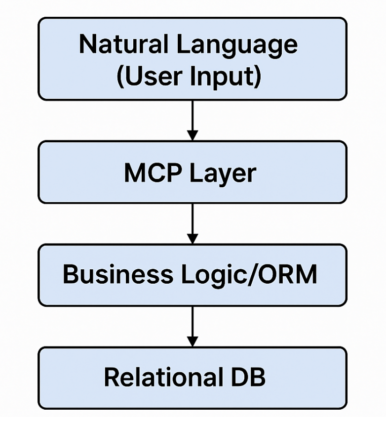

*How business-logic-aware MCP implementations can transform user experiences beyond simple database management*

# Potential of MCP in Database Applications is still underestimated

---

## The Current State of MCP in Databases

MCP (Model Context Protocol) has been gaining significant attention lately, but I believe its potential in database applications is still largely underestimated. Most current database MCP implementations focus primarily on database administration tasks—exposing capabilities like `SHOW TABLES`, `SHOW DATABASES`, and basic DDL operations like `ALTER TABLE`.

While these implementations often include natural language to SQL capabilities, they operate at a very generic level, similar to early database administration tools like PHPMyAdmin. They don't deeply understand your database schema or the business meaning behind your data columns.

## Beyond Generic Database Management

Let me illustrate the difference with a concrete example. Imagine we have a database for a chat application that stores user conversations. A traditional MCP implementation might help a DBA view tables, count rows, and run statistical queries. But what if we want to do something more business-specific?

Consider this scenario: *"Find all of Alice's chat messages that mention ClickHouse and replace 'ClickHouse' with 'chDB' in those messages."*

Current generic MCP implementations could probably generate the SQL to find these messages, but the update operation would require database administrator privileges due to security concerns. This creates a significant barrier between users and their data.

## The Business-Logic Layer Approach

The solution lies in implementing an abstraction layer between MCP and the database—what I call a "business-logic-aware ORM layer." Instead of directly exposing database operations, we create domain-specific functions that understand the business context.



Here's how this might look in practice:

### Basic ORM-Based MCP Structure

```python
# database/models.py
from sqlalchemy import Column, Integer, String, DateTime, Text, ForeignKey
from sqlalchemy.ext.declarative import declarative_base
from sqlalchemy.orm import relationship

Base = declarative_base()

class User(Base):
    __tablename__ = 'users'
    
    id = Column(Integer, primary_key=True)
    username = Column(String(50), unique=True, nullable=False)
    email = Column(String(100), unique=True, nullable=False)
    created_at = Column(DateTime, nullable=False)
    
    messages = relationship("ChatMessage", back_populates="user")

class ChatMessage(Base):
    __tablename__ = 'chat_messages'
    
    id = Column(Integer, primary_key=True)
    user_id = Column(Integer, ForeignKey('users.id'), nullable=False)
    content = Column(Text, nullable=False)
    timestamp = Column(DateTime, nullable=False)
    channel = Column(String(100))
    
    user = relationship("User", back_populates="messages")
```

### Business-Logic MCP Functions

```python
# mcp/chat_operations.py
from typing import List, Optional
from sqlalchemy.orm import Session
from models import User, ChatMessage

class ChatMCPOperations:
    def __init__(self, db_session: Session):
        self.db = db_session
    
    def list_user_messages(self, username: str, 
                          keyword: Optional[str] = None, 
                          limit: int = 50) -> List[dict]:
        """List messages for a specific user, optionally filtered by keyword"""
        query = self.db.query(ChatMessage).join(User).filter(
            User.username == username
        )
        
        if keyword:
            query = query.filter(ChatMessage.content.contains(keyword))
            
        messages = query.order_by(ChatMessage.timestamp.desc()).limit(limit).all()
        
        return [{
            'id': msg.id,
            'content': msg.content,
            'timestamp': msg.timestamp.isoformat(),
            'channel': msg.channel
        } for msg in messages]
    
    def update_user_message_content(self, username: str, 
                                   find_text: str, 
                                   replace_text: str) -> dict:
        """Replace text in user's messages - with proper authorization"""
        user = self.db.query(User).filter(User.username == username).first()
        if not user:
            raise ValueError(f"User {username} not found")
        
        # Business logic: users can only modify their own messages
        messages = self.db.query(ChatMessage).filter(
            ChatMessage.user_id == user.id,
            ChatMessage.content.contains(find_text)
        ).all()
        
        updated_count = 0
        for message in messages:
            message.content = message.content.replace(find_text, replace_text)
            updated_count += 1
        
        self.db.commit()
        
        return {
            'updated_messages': updated_count,
            'user': username,
            'replacement': f"{find_text} → {replace_text}"
        }
```

### MCP Server Implementation

```python
# mcp_server.py
import asyncio
from mcp.server import Server
from mcp.server.models import InitializationOptions
import mcp.server.stdio
import mcp.types as types
from sqlalchemy import create_engine
from sqlalchemy.orm import sessionmaker
from chat_operations import ChatMCPOperations

# Database setup
engine = create_engine('sqlite:///chat_app.db')
SessionLocal = sessionmaker(autocommit=False, autoflush=False, bind=engine)

class ChatMCPServer:
    def __init__(self):
        self.server = Server("chat-mcp-server")
        self.setup_handlers()
    
    def setup_handlers(self):
        @self.server.list_tools()
        async def handle_list_tools() -> list[types.Tool]:
            return [
                types.Tool(
                    name="list_user_messages",
                    description="List messages for a specific user",
                    inputSchema={
                        "type": "object",
                        "properties": {
                            "username": {"type": "string"},
                            "keyword": {"type": "string", "description": "Optional keyword filter"},
                            "limit": {"type": "integer", "default": 50}
                        },
                        "required": ["username"]
                    }
                ),
                types.Tool(
                    name="replace_text_in_messages",
                    description="Replace text in user's chat messages",
                    inputSchema={
                        "type": "object",
                        "properties": {
                            "username": {"type": "string"},
                            "find_text": {"type": "string"},
                            "replace_text": {"type": "string"}
                        },
                        "required": ["username", "find_text", "replace_text"]
                    }
                )
            ]
        
        @self.server.call_tool()
        async def handle_call_tool(name: str, arguments: dict) -> list[types.TextContent]:
            db_session = SessionLocal()
            chat_ops = ChatMCPOperations(db_session)
            
            try:
                if name == "list_user_messages":
                    result = chat_ops.list_user_messages(
                        username=arguments["username"],
                        keyword=arguments.get("keyword"),
                        limit=arguments.get("limit", 50)
                    )
                    return [types.TextContent(
                        type="text",
                        text=f"Found {len(result)} messages:\n" + 
                             "\n".join([f"[{msg['timestamp']}] {msg['content'][:100]}..." 
                                       for msg in result])
                    )]
                
                elif name == "replace_text_in_messages":
                    result = chat_ops.update_user_message_content(
                        username=arguments["username"],
                        find_text=arguments["find_text"],
                        replace_text=arguments["replace_text"]
                    )
                    return [types.TextContent(
                        type="text",
                        text=f"Updated {result['updated_messages']} messages for {result['user']}. "
                             f"Replaced '{arguments['find_text']}' with '{arguments['replace_text']}'"
                    )]
                
            except Exception as e:
                return [types.TextContent(type="text", text=f"Error: {str(e)}")]
            finally:
                db_session.close()

async def main():
    server_instance = ChatMCPServer()
    async with mcp.server.stdio.stdio_server() as (read_stream, write_stream):
        await server_instance.server.run(
            read_stream, 
            write_stream, 
            InitializationOptions(
                server_name="chat-mcp-server",
                server_version="0.1.0"
            )
        )

if __name__ == "__main__":
    asyncio.run(main())
```

### Generic DB MCP vs Business-Aware MCP

| Feature                       | Generic DB MCP | Business-Aware MCP                |
| ----------------------------- | ----------- | --------------------------------- |
| Show Tables / Describe Schema | ✅           | ✅                                 |
| Natural Language to SQL       | ✅           | ✅                                 |
| Understand Business Context   | ❌           | ✅                                 |
| Enforce User Permissions      | ❌           | ✅                                 |
| High-level domain operations  | ❌           | ✅ （Like replace\_text\_in\_messages） |
| User-friendly error handling  | ❌           | ✅                                 |


## The Power of Local Embedded Databases

The real magic happens when we apply this approach to embedded databases in client applications. Unlike centralized databases, embedded databases like SQLite or chDB have fewer permission constraints since they're owned by the individual user.

Consider a calendar management application:

### Calendar MCP Example

```python
# calendar_mcp.py
from datetime import datetime, timedelta
from sqlalchemy import Column, Integer, String, DateTime, Boolean
from sqlalchemy.ext.declarative import declarative_base

Base = declarative_base()

class CalendarEvent(Base):
    __tablename__ = 'calendar_events'
    
    id = Column(Integer, primary_key=True)
    title = Column(String(200), nullable=False)
    description = Column(String(1000))
    start_time = Column(DateTime, nullable=False)
    end_time = Column(DateTime, nullable=False)
    attendees = Column(String(500))  # JSON string of attendees
    location = Column(String(200))
    is_recurring = Column(Boolean, default=False)

class CalendarMCPOperations:
    def __init__(self, db_session):
        self.db = db_session
    
    def list_events(self, start_time: datetime, end_time: datetime) -> List[dict]:
        """List all events scheduled within the specified time range"""
        events = self.db.query(CalendarEvent).filter(
            CalendarEvent.start_time >= start_time,
            CalendarEvent.start_time <= end_time
        ).order_by(CalendarEvent.start_time).all()
        
        return [{
            'id': event.id,
            'title': event.title,
            'start_time': event.start_time.isoformat(),
            'end_time': event.end_time.isoformat(),
            'attendees': event.attendees,
            'location': event.location
        } for event in events]
    
    def reschedule_meeting(self, meeting_title: str, attendee_name: str, delay_hours: int) -> dict:
        """Reshedule a meeting with specific attendee"""
        event = self.db.query(CalendarEvent).filter(
            CalendarEvent.title.contains(meeting_title),
            CalendarEvent.attendees.contains(attendee_name)
        ).first()
        
        if not event:
            raise ValueError(f"No meeting found with title '{meeting_title}' and attendee '{attendee_name}'")
        
        # Update the event times
        original_start = event.start_time
        event.start_time += timedelta(hours=delay_hours)
        event.end_time += timedelta(hours=delay_hours)
        
        self.db.commit()
        
        return {
            'event_id': event.id,
            'title': event.title,
            'original_time': original_start.isoformat(),
            'new_time': event.start_time.isoformat(),
            'delay_applied': f"{delay_hours} hours"
        }
    
    def add_event_from_image_data(self, extracted_data: dict) -> dict:
        """Add calendar event from extracted flight booking data"""
        new_event = CalendarEvent(
            title=f"Flight {extracted_data.get('flight_number', 'TBD')}",
            description=f"Flight from {extracted_data.get('departure_city')} to {extracted_data.get('arrival_city')}",
            start_time=datetime.fromisoformat(extracted_data['departure_time']),
            end_time=datetime.fromisoformat(extracted_data['arrival_time']),
            location=extracted_data.get('departure_airport', ''),
            attendees=extracted_data.get('passenger_name', '')
        )
        
        self.db.add(new_event)
        self.db.commit()
        
        return {
            'event_id': new_event.id,
            'title': new_event.title,
            'created': True
        }
```

## User Experience Transformation

With this business-logic-aware MCP implementation, users can interact with their applications in natural language:

- **"List my events for tomorrow"** → Executes `list_events()`
- **"Delay my meeting with Tom by one hour"** → Executes `reschedule_meeting("meeting", "Tom", 1)`
- **"What can you help me with?"** → Agent intelligently describes available calendar operations
- **"Correct all the ClickHouse to chDB in my messages"** → Executes `replace_text_in_messages("ClickHouse", "chDB")`

The agent can even handle multi-step operations with confirmation:

**User**: *"Delete all calendar events that mention 'test'"*

**Agent**: *"I found 3 events mentioning 'test':
1. Test meeting with Sarah (tomorrow 2pm)  
2. Testing new feature (Friday 10am)
3. Test deployment review (next Monday)

Should I proceed with deleting these events?"*

**User**: *"Yes, delete them"*

**Agent**: *"Done! Deleted 3 events containing 'test'."*

## Visual Integration: From Screenshots to Data

Perhaps the most impressive capability is visual integration. Users can take a screenshot of a flight booking confirmation and simply drop it into the chat interface. The agent analyzes the image, extracts flight details, and automatically creates calendar events—all without requiring any code changes to the underlying ORM layer.

## Why This Matters

This approach transforms traditional applications from rigid, menu-driven interfaces into conversational, intelligent agents. The key advantages:

1. **User Empowerment**: Users can perform complex operations without navigating multiple screens
2. **Natural Interaction**: Commands can be expressed in natural language rather than learning specific UI patterns  
3. **Safety**: Business logic layer provides appropriate permissions and validation
4. **Maintainability**: Seperation of concerns between data operations and user interface
5. **Extensibility**: New capabilities can be added by implemeting new business-logic functions
6. **AI Coding Friendly**: AI could work better with business-logic-aware MCP functions, and the agent will help you to implement&test and even use the fucntion.

## Looking Forward

While generic database MCP implementations are valuable for data analysis and SQL generation, the real breakthrough comes from creating domain-specific, business-logic-aware MCP layers. These implementations unlock new levels of user experience that feel almost magical—turning every application into an intelligent assistant that truly understands your data and your needs.

The combination of modern language models like Claude Sonnet 4.0 with well-designed ORM-based MCP implementations creates unprecedented opportunities for application developers to build more intuitive, powerful user experiences with surprisingly little additional code.

---

*This represents just the beginning of what's possible when we think beyond generic database access and focus on business-context-aware MCP implementations. The future of application interfaces is conversational, intelligent, and deeply integrated with our data.*