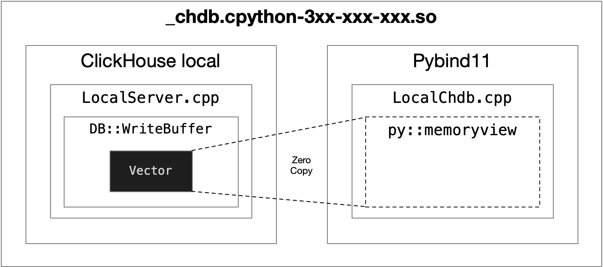
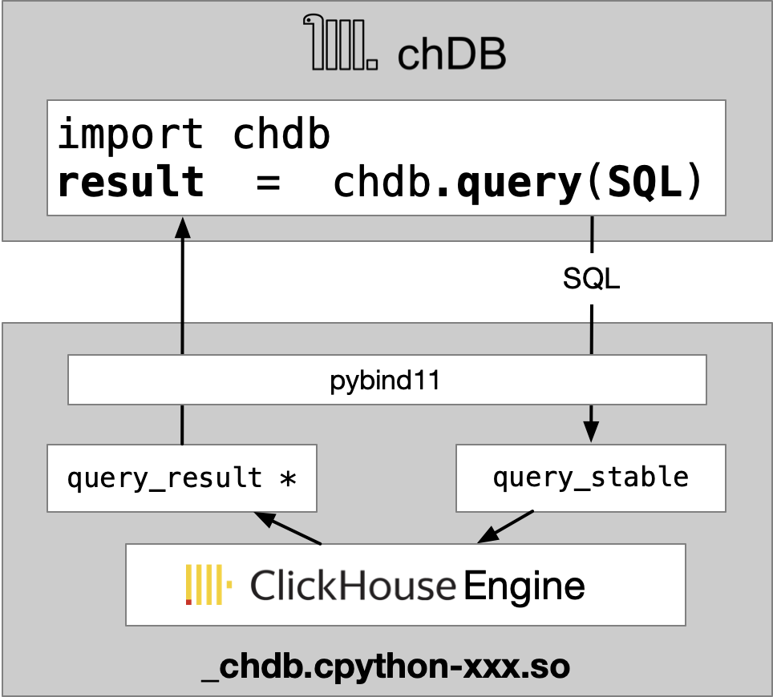
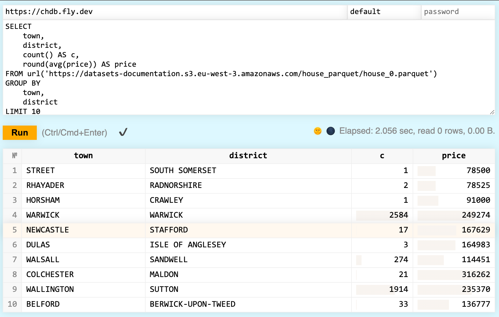
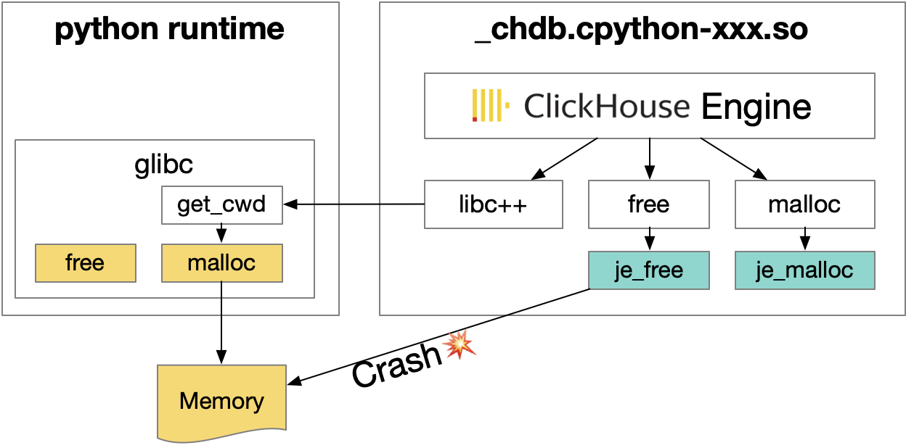
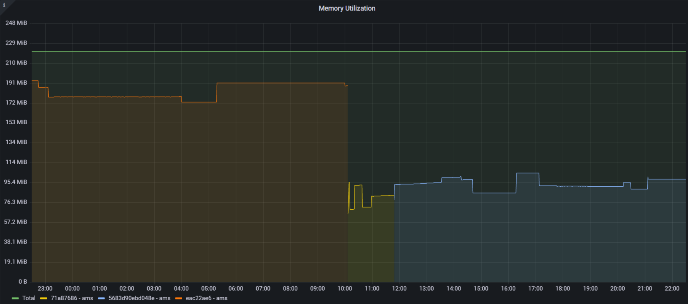
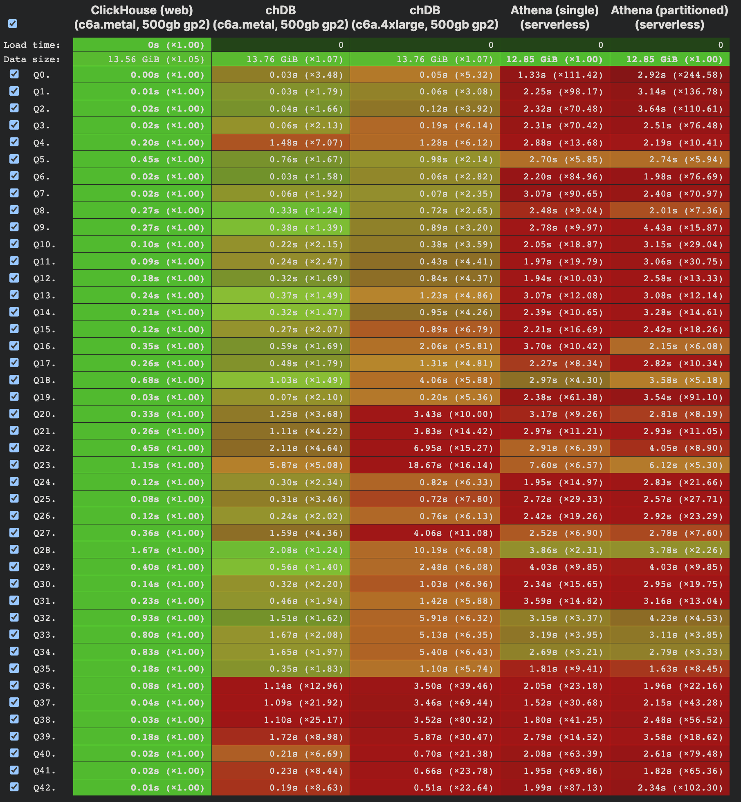
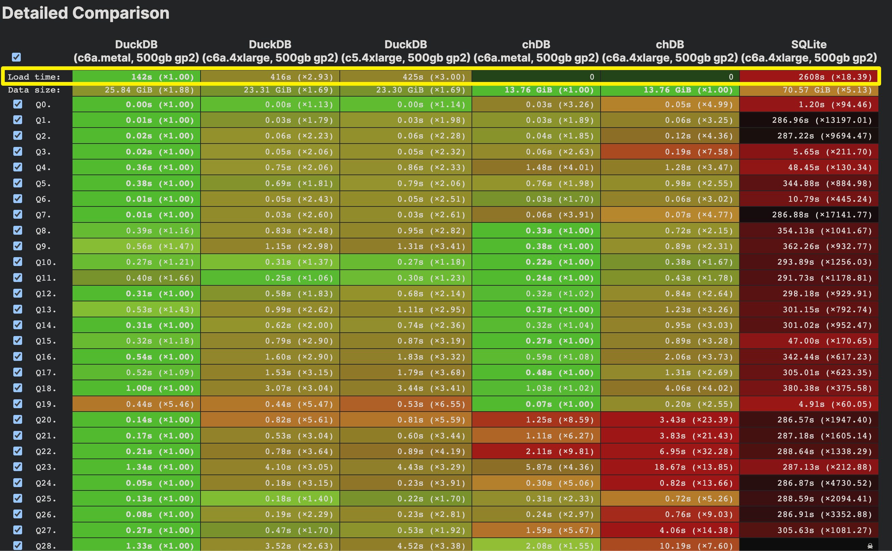

---
title: "The birth of chDB"
date: 2023-07-08T12:08:19+08:00
draft: false

---


# Rocket Engine on a Bicycle

Before officially starting the journey of chDB, I think it's best to give a brief introduction to ClickHouse. In recent years, "vectorized engines" have been particularly popular in the OLAP database community. The main reason is the addition of more and more SIMD instructions in CPUs, which greatly accelerates Aggregation, Sort, and Join operations for large amounts of data in OLAP scenarios. ClickHouse has made very detailed optimizations in multiple areas such as "vectorization", which can be seen from its [optimization on lz4 and memcpy](https://habr.com/en/companies/yandex/articles/457612/).

If there is controversy about whether ClickHouse is the best-performing OLAP engine, at least it belongs to the top tier according to [benchmarks](https://benchmark.clickhouse.com/). Apart from performance, ClickHouse also boasts powerful features that make it a Swiss Army Knife in the world of databases:

1. Directly querying data stored on S3, GCS, and other object storages.
2. Using ReplacingMergeTree to simplify handling changing data.
3. Completing cross-database data queries and even table joins without relying on third-party tools.
4. Even automatically performing Predicate Pushdown.

Developing and maintaining a production-ready and efficient SQL engine requires talent and time. As one of the leading OLAP engines, Alexey Milovidov and his team have dedicated 14 years to ClickHouse development. Since ClickHouse has done so much work on SQL engines already, why not consider extracting its engine into a Python module? It feels like installing a rocket engine 🚀 onto a bicycle 🚴🏻.

In February 2023, I started developing chDB with the main goal of making the powerful ClickHouse engine available as an "out-of-the-box" Python module. ClickHouse already has a standalone version called `clickhouse-local` that can be run from command line independently; this makes it even more feasible for chDB.


## Hacking ClickHouse
Actually, there is a very simple and straightforward implementation: directly include the `clickhouse-local` binary in the Python package, and then pass SQL to it through something like `popen`, retrieving the results through a pipe.


However, this approach brings several additional problems:

1. Starting an independent process for each query would greatly impact performance, especially when the `clickhouse-local` binary file is approximately 500MB in size.
2. Multiple copies of SQL query results are inevitable.
3. Integration with Python is limited, making it difficult to implement Python UDFs and support SQL on Pandas DataFrame.
4. Most importantly, it lacks elegance 😎

Thanks to ClickHouse's well-structured codebase, I was able to successfully hack into it among over 900k lines of code during the Chinese New Year while either eating or hacking ClickHouse.

ClickHouse includes a series of implementations called `BufferBase`, including `ReadBuffer` and `WriteBuffer`, which correspond roughly to C++'s `istream` and `ostream`. In order to efficiently read from files and output results (e.g., reading CSV or JSONEachRow and outputting SQL execution results), ClickHouse's Buffer also supports random access to underlying memory. It can even create new Buffers based on vector without copying memory. ClickHouse internally uses derived classes of `BufferBase` for reading/writing compressed files as well as remote files (S3, HTTP).

To achieve zero-copy retrieval of SQL execution results at the ClickHouse level, I used the built-in `WriteBufferFromVector` instead of stdout for receiving data. This ensures that parallel output pipelines won't be blocked while conveniently obtaining the original memory blocks of SQL execution outputs.

To avoid memory copying from C++ to Python objects, I utilized Python's `memoryview` for direct memory mapping.




Due to the maturity of Pybind11, it is now easy to bind the construction and destruction of C++ classes with the lifecycle of Python objects. All this can be achieved with a simple class template definition:

```c++
class __attribute__((visibility("default"))) query_result {
public:
		query_result(local_result * result) : result(result);
    ~query_result();
}
py::class_<query_result>(m, "query_result")
```

In this way, chDB can basically be up and running, and I am very excited to release it. The architecture of chDB is roughly depicted in the following diagram:



## Team up

After the release of chDB, [Lorenzo](https://github.com/lmangani) quickly contacted me. He raised an [issue](https://github.com/chdb-io/chdb/issues/7), suggesting that removing the dependency on AVX2 instruction set could make chDB more convenient to run on Lambda services. I promptly implemented this feature, and afterwards Lorenzo created a demo for chDB on fly.io. To be honest, I had never imagined such usage before.



Initially, I developed chDB with the sole purpose of creating a ClickHouse engine that could run independently in Jupyter Notebook. This would allow me to easily access large amounts of annotation information without having to rely on slow Hive clusters when training CV models using Python. Surprisingly, the standalone version of chDB actually outperformed the Hive cluster consisting of hundreds of servers in most scenarios.

Subsequently, Lorenzo and his team developed bindings for chDB in Golang, NodeJS, Rust, and Bun. To bring all these projects together, I created the [chdb.io](https://github.com/chdb-io) organization on GitHub.

Later on, @[laodouya](https://github.com/laodouya) contributed an implementation of the Python DB API 2.0 interface for chDB. @[nmreadelf](https://github.com/nmreadelf) added support for Dataframe output format in chDB. Friends such as @[dchimeno](https://github.com/dchimeno), @[Berry](https://github.com/xbsura), @[Dan Goodman](https://github.com/danthegoodman1), @[Sebastian Gale](https://github.com/seblz432), @[Mimoune](https://github.com/djouallah), @[schaal](https://github.com/schalekamp), and @[alanpaulkwan](https://github.com/alanpaulkwan) have also raised many valuable issues for chDB.


## Jemalloc in so

chDB has done a lot of performance optimization work, including the extremely difficult task of porting jemalloc to chdb's shared library.

After carefully [analyzing chDB's performance](https://github.com/chdb-io/chdb/issues/19) in [Clickbench](https://benchmark.clickhouse.com/#eyJzeXN0ZW0iOnsiQXRoZW5hIChwYXJ0aXRpb25lZCkiOnRydWUsIkF0aGVuYSAoc2luZ2xlKSI6dHJ1ZSwiQXVyb3JhIGZvciBNeVNRTCI6dHJ1ZSwiQXVyb3JhIGZvciBQb3N0Z3JlU1FMIjp0cnVlLCJCeXRlSG91c2UiOnRydWUsImNoREIiOnRydWUsIkNpdHVzIjp0cnVlLCJjbGlja2hvdXNlLWxvY2FsIChwYXJ0aXRpb25lZCkiOnRydWUsImNsaWNraG91c2UtbG9jYWwgKHNpbmdsZSkiOnRydWUsIkNsaWNrSG91c2UgKHdlYikiOnRydWUsIkNsaWNrSG91c2UiOnRydWUsIkNsaWNrSG91c2UgKHR1bmVkKSI6dHJ1ZSwiQ2xpY2tIb3VzZSAoenN0ZCkiOnRydWUsIkNsaWNrSG91c2UgQ2xvdWQiOnRydWUsIkNyYXRlREIiOnRydWUsIkRhdGFiZW5kIjp0cnVlLCJEYXRhRnVzaW9uIChzaW5nbGUgcGFycXVldCkiOnRydWUsIkFwYWNoZSBEb3JpcyI6dHJ1ZSwiRHJ1aWQiOnRydWUsIkR1Y2tEQiAoUGFycXVldCkiOnRydWUsIkR1Y2tEQiI6dHJ1ZSwiRWxhc3RpY3NlYXJjaCI6dHJ1ZSwiRWxhc3RpY3NlYXJjaCAodHVuZWQpIjpmYWxzZSwiR3JlZW5wbHVtIjp0cnVlLCJIZWF2eUFJIjp0cnVlLCJIeWRyYSI6dHJ1ZSwiSW5mb2JyaWdodCI6dHJ1ZSwiS2luZXRpY2EiOnRydWUsIk1hcmlhREIgQ29sdW1uU3RvcmUiOnRydWUsIk1hcmlhREIiOmZhbHNlLCJNb25ldERCIjp0cnVlLCJNb25nb0RCIjp0cnVlLCJNeVNRTCAoTXlJU0FNKSI6dHJ1ZSwiTXlTUUwiOnRydWUsIlBpbm90Ijp0cnVlLCJQb3N0Z3JlU1FMICh0dW5lZCkiOmZhbHNlLCJQb3N0Z3JlU1FMIjp0cnVlLCJRdWVzdERCIChwYXJ0aXRpb25lZCkiOnRydWUsIlF1ZXN0REIiOnRydWUsIlJlZHNoaWZ0Ijp0cnVlLCJTZWxlY3REQiI6dHJ1ZSwiU2luZ2xlU3RvcmUiOnRydWUsIlNub3dmbGFrZSI6dHJ1ZSwiU1FMaXRlIjp0cnVlLCJTdGFyUm9ja3MiOnRydWUsIlRpbWVzY2FsZURCIChjb21wcmVzc2lvbikiOnRydWUsIlRpbWVzY2FsZURCIjp0cnVlfSwidHlwZSI6eyJzdGF0ZWxlc3MiOnRydWUsIm1hbmFnZWQiOmZhbHNlLCJKYXZhIjpmYWxzZSwiY29sdW1uLW9yaWVudGVkIjpmYWxzZSwiQysrIjpmYWxzZSwiTXlTUUwgY29tcGF0aWJsZSI6ZmFsc2UsInJvdy1vcmllbnRlZCI6ZmFsc2UsIkMiOmZhbHNlLCJQb3N0Z3JlU1FMIGNvbXBhdGlibGUiOmZhbHNlLCJDbGlja0hvdXNlIGRlcml2YXRpdmUiOmZhbHNlLCJlbWJlZGRlZCI6ZmFsc2UsInNlcnZlcmxlc3MiOmZhbHNlLCJSdXN0IjpmYWxzZSwic2VhcmNoIjpmYWxzZSwiZG9jdW1lbnQiOmZhbHNlLCJ0aW1lLXNlcmllcyI6ZmFsc2V9LCJtYWNoaW5lIjp7InNlcnZlcmxlc3MiOnRydWUsIjE2YWN1Ijp0cnVlLCJMIjp0cnVlLCJNIjp0cnVlLCJTIjp0cnVlLCJYUyI6dHJ1ZSwiYzZhLm1ldGFsLCA1MDBnYiBncDIiOnRydWUsImM2YS40eGxhcmdlLCA1MDBnYiBncDIiOnRydWUsImM1bi40eGxhcmdlLCAyMDBnYiBncDIiOnRydWUsImM1LjR4bGFyZ2UsIDUwMGdiIGdwMiI6dHJ1ZSwiMTYgdGhyZWFkcyI6dHJ1ZSwiMjAgdGhyZWFkcyI6dHJ1ZSwiMjQgdGhyZWFkcyI6dHJ1ZSwiMjggdGhyZWFkcyI6dHJ1ZSwiMzAgdGhyZWFkcyI6dHJ1ZSwiNDggdGhyZWFkcyI6dHJ1ZSwiNjAgdGhyZWFkcyI6dHJ1ZSwibTVkLjI0eGxhcmdlIjp0cnVlLCJjNmEuNHhsYXJnZSwgMTUwMGdiIGdwMiI6dHJ1ZSwiZGMyLjh4bGFyZ2UiOnRydWUsInJhMy4xNnhsYXJnZSI6dHJ1ZSwicmEzLjR4bGFyZ2UiOnRydWUsInJhMy54bHBsdXMiOnRydWUsIlMyIjp0cnVlLCJTMjQiOnRydWUsIjJYTCI6dHJ1ZSwiM1hMIjp0cnVlLCI0WEwiOnRydWUsIlhMIjp0cnVlfSwiY2x1c3Rlcl9zaXplIjp7IjEiOnRydWUsIjIiOnRydWUsIjQiOnRydWUsIjgiOnRydWUsIjE2Ijp0cnVlLCIzMiI6dHJ1ZSwiNjQiOnRydWUsIjEyOCI6dHJ1ZSwic2VydmVybGVzcyI6dHJ1ZSwidW5kZWZpbmVkIjp0cnVlfSwibWV0cmljIjoiaG90IiwicXVlcmllcyI6W3RydWUsdHJ1ZSx0cnVlLHRydWUsdHJ1ZSx0cnVlLHRydWUsdHJ1ZSx0cnVlLHRydWUsdHJ1ZSx0cnVlLHRydWUsdHJ1ZSx0cnVlLHRydWUsdHJ1ZSx0cnVlLHRydWUsdHJ1ZSx0cnVlLHRydWUsdHJ1ZSx0cnVlLHRydWUsdHJ1ZSx0cnVlLHRydWUsdHJ1ZSx0cnVlLHRydWUsdHJ1ZSx0cnVlLHRydWUsdHJ1ZSx0cnVlLHRydWUsdHJ1ZSx0cnVlLHRydWUsdHJ1ZSx0cnVlLHRydWVdfQ==), it was found that there is a significant performance gap between chDB and clickhouse-local in Q23. It is believed that this difference is due to the fact that when implementing Q23, chDB simplified the process by removing jemalloc. Let's fix it!

ClickHouse engine includes hundreds of submodules, including heavyweight libraries such as Boost and LLVM. In order to ensure good compatibility with libc and libc++ and implement JIT execution engine, ClickHouse links with its own version of LLVM as the libc used for linking. The binary of ClickHouse can easily guarantee overall link security. However, for chdb as a shared object (so), this part becomes exceptionally challenging due to several reasons:

1. Python runtime has its own libc. After loading chdb.so, many memory allocation & management functions that should have been linked to jemalloc in ClickHouse binary will unavoidably be connected to Python's built-in libc through @plt.
2. To solve the above problem, one solution is modifying ClickHouse source code so that all relevant functions are explicitly called with `je_` prefix, such as `je_malloc`, `je_free`. But this approach brings two new problems; one of which can be easily solved:
3. Modifying third-party library's malloc calling code would be a huge project. I used a trick when linking with clang++: `-Wl,-wrap,malloc`. For example, during the linking phase, all calls to malloc symbol are redirected to `__wrap_malloc`. You can refer to this piece of code in chDB: [mallocAdapt.c](https://github.com/chdb-io/chdb/blob/main/src/Common/mallocAdapt.c#L23)

It seems like the issue has been resolved, but a real nightmare has emerged. chDB still occasionally crashes on some `je_free` calls. After relentless investigation, it was finally discovered to be an ancient legacy issue with libc:

> When writing C code, malloc/calloc is generally paired with free. We will try our best to avoid returning memory allocated on the heap by `malloc` from within a function. This is because it can easily lead to the caller forgetting to call `free`, resulting in memory leaks.
>
> However, due to historical legacy issues, there are certain functions in GNU libc such as [getcwd() and get_current_dir_name()](https://man7.org/linux/man-pages/man3/getcwd.3.html) that internally call `malloc` to allocate their own memory and return it.

And these functions are widely used in libraries like STL and Boost for implementing path-related functions. Therefore, we encounter a situation where getcwd returns memory allocated by glibc's version of malloc, but we attempt to release it using `je_free`. So... Crash! 💥



If jemalloc could provide an interface to query whether the memory pointed by a pointer is allocated by jemalloc, that would be great. We just need to check it before calling `je_free` like below.

```c
void __wrap_free(void * ptr)
{
    int arena_ind;
    if (unlikely(ptr == NULL))
    {
        return;
    }
    // in some glibc functions, the returned buffer is allocated by glibc malloc
    // so we need to free it by glibc free.
    // eg. getcwd, see: https://man7.org/linux/man-pages/man3/getcwd.3.html
    // so we need to check if the buffer is allocated by jemalloc
    // if not, we need to free it by glibc free
    arena_ind = je_mallctl("arenas.lookup", NULL, NULL, &ptr, sizeof(ptr));
    if (unlikely(arena_ind != 0)) {
        __real_free(ptr);
        return;
    }
    je_free(ptr);
}
```

But unfortunately, the `mallctl` of `jemalloc` can fail on assert when using `arenas.lookup` to query memory that was not allocated by `jemalloc`...

Lookup causing assertion failure? That's clearly not ideal, so I submitted a patch to jemalloc: [#2424 Make arenas_lookup_ctl triable](https://github.com/jemalloc/jemalloc/pull/2424). The official repository has already merged this PR. Therefore, I have now become a contributor to jemalloc 😄.

## Show time

Through several weeks of effort on ClickHouse and jemalloc, the memory usage of chDB has been significantly reduced by 50%.



According to the data on ClickBench, chDB is currently the [fastest stateless and serverless database](https://benchmark.clickhouse.com/#eyJzeXN0ZW0iOnsiQXRoZW5hIChwYXJ0aXRpb25lZCkiOnRydWUsIkF0aGVuYSAoc2luZ2xlKSI6dHJ1ZSwiQXVyb3JhIGZvciBNeVNRTCI6dHJ1ZSwiQXVyb3JhIGZvciBQb3N0Z3JlU1FMIjp0cnVlLCJCeXRlSG91c2UiOnRydWUsImNoREIiOnRydWUsIkNpdHVzIjp0cnVlLCJjbGlja2hvdXNlLWxvY2FsIChwYXJ0aXRpb25lZCkiOnRydWUsImNsaWNraG91c2UtbG9jYWwgKHNpbmdsZSkiOnRydWUsIkNsaWNrSG91c2UiOnRydWUsIkNsaWNrSG91c2UgKHR1bmVkKSI6dHJ1ZSwiQ2xpY2tIb3VzZSAoenN0ZCkiOnRydWUsIkNsaWNrSG91c2UgQ2xvdWQiOnRydWUsIkNsaWNrSG91c2UgKHdlYikiOnRydWUsIkNyYXRlREIiOnRydWUsIkRhdGFiZW5kIjp0cnVlLCJEYXRhRnVzaW9uIChzaW5nbGUpIjp0cnVlLCJBcGFjaGUgRG9yaXMiOnRydWUsIkRydWlkIjp0cnVlLCJEdWNrREIgKFBhcnF1ZXQpIjp0cnVlLCJEdWNrREIiOnRydWUsIkVsYXN0aWNzZWFyY2giOnRydWUsIkVsYXN0aWNzZWFyY2ggKHR1bmVkKSI6dHJ1ZSwiR3JlZW5wbHVtIjp0cnVlLCJIZWF2eUFJIjp0cnVlLCJIeWRyYSI6dHJ1ZSwiSW5mb2JyaWdodCI6dHJ1ZSwiS2luZXRpY2EiOnRydWUsIk1hcmlhREIgQ29sdW1uU3RvcmUiOnRydWUsIk1hcmlhREIiOnRydWUsIk1vbmV0REIiOnRydWUsIk1vbmdvREIiOnRydWUsIk15U1FMIChNeUlTQU0pIjp0cnVlLCJNeVNRTCI6dHJ1ZSwiUGlub3QiOnRydWUsIlBvc3RncmVTUUwiOnRydWUsIlBvc3RncmVTUUwgKHR1bmVkKSI6dHJ1ZSwiUXVlc3REQiAocGFydGl0aW9uZWQpIjp0cnVlLCJRdWVzdERCIjp0cnVlLCJSZWRzaGlmdCI6dHJ1ZSwiU2VsZWN0REIiOnRydWUsIlNpbmdsZVN0b3JlIjp0cnVlLCJTbm93Zmxha2UiOnRydWUsIlNRTGl0ZSI6dHJ1ZSwiU3RhclJvY2tzIjp0cnVlLCJUaW1lc2NhbGVEQiAoY29tcHJlc3Npb24pIjp0cnVlLCJUaW1lc2NhbGVEQiI6dHJ1ZX0sInR5cGUiOnsic3RhdGVsZXNzIjp0cnVlLCJtYW5hZ2VkIjpmYWxzZSwiSmF2YSI6ZmFsc2UsImNvbHVtbi1vcmllbnRlZCI6ZmFsc2UsIkMrKyI6ZmFsc2UsIk15U1FMIGNvbXBhdGlibGUiOmZhbHNlLCJyb3ctb3JpZW50ZWQiOmZhbHNlLCJDIjpmYWxzZSwiUG9zdGdyZVNRTCBjb21wYXRpYmxlIjpmYWxzZSwiQ2xpY2tIb3VzZSBkZXJpdmF0aXZlIjpmYWxzZSwiZW1iZWRkZWQiOmZhbHNlLCJzZXJ2ZXJsZXNzIjpmYWxzZSwiUnVzdCI6ZmFsc2UsInNlYXJjaCI6ZmFsc2UsImRvY3VtZW50IjpmYWxzZSwidGltZS1zZXJpZXMiOmZhbHNlfSwibWFjaGluZSI6eyJzZXJ2ZXJsZXNzIjp0cnVlLCIxNmFjdSI6dHJ1ZSwiTCI6dHJ1ZSwiTSI6dHJ1ZSwiUyI6dHJ1ZSwiWFMiOnRydWUsImM2YS5tZXRhbCwgNTAwZ2IgZ3AyIjp0cnVlLCJjNmEuNHhsYXJnZSwgNTAwZ2IgZ3AyIjp0cnVlLCJjNS40eGxhcmdlLCA1MDBnYiBncDIiOnRydWUsIjE2IHRocmVhZHMiOnRydWUsIjIwIHRocmVhZHMiOnRydWUsIjI0IHRocmVhZHMiOnRydWUsIjI4IHRocmVhZHMiOnRydWUsIjMwIHRocmVhZHMiOnRydWUsIjQ4IHRocmVhZHMiOnRydWUsIjYwIHRocmVhZHMiOnRydWUsIm01ZC4yNHhsYXJnZSI6dHJ1ZSwiYzVuLjR4bGFyZ2UsIDIwMGdiIGdwMiI6dHJ1ZSwiYzZhLjR4bGFyZ2UsIDE1MDBnYiBncDIiOnRydWUsImRjMi44eGxhcmdlIjp0cnVlLCJyYTMuMTZ4bGFyZ2UiOnRydWUsInJhMy40eGxhcmdlIjp0cnVlLCJyYTMueGxwbHVzIjp0cnVlLCJTMjQiOnRydWUsIlMyIjp0cnVlLCIyWEwiOnRydWUsIjNYTCI6dHJ1ZSwiNFhMIjp0cnVlLCJYTCI6dHJ1ZX0sImNsdXN0ZXJfc2l6ZSI6eyIxIjp0cnVlLCIyIjp0cnVlLCI0Ijp0cnVlLCI4Ijp0cnVlLCIxNiI6dHJ1ZSwiMzIiOnRydWUsIjY0Ijp0cnVlLCIxMjgiOnRydWUsInNlcnZlcmxlc3MiOnRydWUsInVuZGVmaW5lZCI6dHJ1ZX0sIm1ldHJpYyI6ImhvdCIsInF1ZXJpZXMiOlt0cnVlLHRydWUsdHJ1ZSx0cnVlLHRydWUsdHJ1ZSx0cnVlLHRydWUsdHJ1ZSx0cnVlLHRydWUsdHJ1ZSx0cnVlLHRydWUsdHJ1ZSx0cnVlLHRydWUsdHJ1ZSx0cnVlLHRydWUsdHJ1ZSx0cnVlLHRydWUsdHJ1ZSx0cnVlLHRydWUsdHJ1ZSx0cnVlLHRydWUsdHJ1ZSx0cnVlLHRydWUsdHJ1ZSx0cnVlLHRydWUsdHJ1ZSx0cnVlLHRydWUsdHJ1ZSx0cnVlLHRydWUsdHJ1ZSx0cnVlXX0=)（not including ClickHouse Web）



chDB is currently the [fastest implementation on SQL on Parquet](https://benchmark.clickhouse.com/#eyJzeXN0ZW0iOnsiQXRoZW5hIChwYXJ0aXRpb25lZCkiOnRydWUsIkF0aGVuYSAoc2luZ2xlKSI6dHJ1ZSwiQXVyb3JhIGZvciBNeVNRTCI6dHJ1ZSwiQXVyb3JhIGZvciBQb3N0Z3JlU1FMIjp0cnVlLCJCeXRlSG91c2UiOnRydWUsImNoREIiOnRydWUsIkNpdHVzIjp0cnVlLCJjbGlja2hvdXNlLWxvY2FsIChwYXJ0aXRpb25lZCkiOnRydWUsImNsaWNraG91c2UtbG9jYWwgKHNpbmdsZSkiOnRydWUsIkNsaWNrSG91c2UiOnRydWUsIkNsaWNrSG91c2UgKHR1bmVkKSI6dHJ1ZSwiQ2xpY2tIb3VzZSAoenN0ZCkiOnRydWUsIkNsaWNrSG91c2UgQ2xvdWQiOnRydWUsIkNsaWNrSG91c2UgKHdlYikiOnRydWUsIkNyYXRlREIiOnRydWUsIkRhdGFiZW5kIjp0cnVlLCJEYXRhRnVzaW9uIChzaW5nbGUpIjp0cnVlLCJBcGFjaGUgRG9yaXMiOnRydWUsIkRydWlkIjp0cnVlLCJEdWNrREIgKFBhcnF1ZXQpIjp0cnVlLCJEdWNrREIiOnRydWUsIkVsYXN0aWNzZWFyY2giOnRydWUsIkVsYXN0aWNzZWFyY2ggKHR1bmVkKSI6dHJ1ZSwiR3JlZW5wbHVtIjp0cnVlLCJIZWF2eUFJIjp0cnVlLCJIeWRyYSI6dHJ1ZSwiSW5mb2JyaWdodCI6dHJ1ZSwiS2luZXRpY2EiOnRydWUsIk1hcmlhREIgQ29sdW1uU3RvcmUiOnRydWUsIk1hcmlhREIiOnRydWUsIk1vbmV0REIiOnRydWUsIk1vbmdvREIiOnRydWUsIk15U1FMIChNeUlTQU0pIjp0cnVlLCJNeVNRTCI6dHJ1ZSwiUGlub3QiOnRydWUsIlBvc3RncmVTUUwiOnRydWUsIlBvc3RncmVTUUwgKHR1bmVkKSI6dHJ1ZSwiUXVlc3REQiAocGFydGl0aW9uZWQpIjp0cnVlLCJRdWVzdERCIjp0cnVlLCJSZWRzaGlmdCI6dHJ1ZSwiU2VsZWN0REIiOnRydWUsIlNpbmdsZVN0b3JlIjp0cnVlLCJTbm93Zmxha2UiOnRydWUsIlNRTGl0ZSI6dHJ1ZSwiU3RhclJvY2tzIjp0cnVlLCJUaW1lc2NhbGVEQiAoY29tcHJlc3Npb24pIjp0cnVlLCJUaW1lc2NhbGVEQiI6dHJ1ZX0sInR5cGUiOnsic3RhdGVsZXNzIjpmYWxzZSwibWFuYWdlZCI6ZmFsc2UsIkphdmEiOmZhbHNlLCJjb2x1bW4tb3JpZW50ZWQiOmZhbHNlLCJDKysiOmZhbHNlLCJNeVNRTCBjb21wYXRpYmxlIjpmYWxzZSwicm93LW9yaWVudGVkIjpmYWxzZSwiQyI6ZmFsc2UsIlBvc3RncmVTUUwgY29tcGF0aWJsZSI6ZmFsc2UsIkNsaWNrSG91c2UgZGVyaXZhdGl2ZSI6ZmFsc2UsImVtYmVkZGVkIjp0cnVlLCJzZXJ2ZXJsZXNzIjpmYWxzZSwiUnVzdCI6ZmFsc2UsInNlYXJjaCI6ZmFsc2UsImRvY3VtZW50IjpmYWxzZSwidGltZS1zZXJpZXMiOmZhbHNlfSwibWFjaGluZSI6eyJzZXJ2ZXJsZXNzIjp0cnVlLCIxNmFjdSI6dHJ1ZSwiTCI6dHJ1ZSwiTSI6dHJ1ZSwiUyI6dHJ1ZSwiWFMiOnRydWUsImM2YS5tZXRhbCwgNTAwZ2IgZ3AyIjp0cnVlLCJjNmEuNHhsYXJnZSwgNTAwZ2IgZ3AyIjp0cnVlLCJjNS40eGxhcmdlLCA1MDBnYiBncDIiOnRydWUsIjE2IHRocmVhZHMiOnRydWUsIjIwIHRocmVhZHMiOnRydWUsIjI0IHRocmVhZHMiOnRydWUsIjI4IHRocmVhZHMiOnRydWUsIjMwIHRocmVhZHMiOnRydWUsIjQ4IHRocmVhZHMiOnRydWUsIjYwIHRocmVhZHMiOnRydWUsIm01ZC4yNHhsYXJnZSI6dHJ1ZSwiYzVuLjR4bGFyZ2UsIDIwMGdiIGdwMiI6dHJ1ZSwiYzZhLjR4bGFyZ2UsIDE1MDBnYiBncDIiOnRydWUsImRjMi44eGxhcmdlIjp0cnVlLCJyYTMuMTZ4bGFyZ2UiOnRydWUsInJhMy40eGxhcmdlIjp0cnVlLCJyYTMueGxwbHVzIjp0cnVlLCJTMjQiOnRydWUsIlMyIjp0cnVlLCIyWEwiOnRydWUsIjNYTCI6dHJ1ZSwiNFhMIjp0cnVlLCJYTCI6dHJ1ZX0sImNsdXN0ZXJfc2l6ZSI6eyIxIjp0cnVlLCIyIjp0cnVlLCI0Ijp0cnVlLCI4Ijp0cnVlLCIxNiI6dHJ1ZSwiMzIiOnRydWUsIjY0Ijp0cnVlLCIxMjgiOnRydWUsInNlcnZlcmxlc3MiOnRydWUsInVuZGVmaW5lZCI6dHJ1ZX0sIm1ldHJpYyI6ImhvdCIsInF1ZXJpZXMiOlt0cnVlLHRydWUsdHJ1ZSx0cnVlLHRydWUsdHJ1ZSx0cnVlLHRydWUsdHJ1ZSx0cnVlLHRydWUsdHJ1ZSx0cnVlLHRydWUsdHJ1ZSx0cnVlLHRydWUsdHJ1ZSx0cnVlLHRydWUsdHJ1ZSx0cnVlLHRydWUsdHJ1ZSx0cnVlLHRydWUsdHJ1ZSx0cnVlLHRydWUsdHJ1ZSx0cnVlLHRydWUsdHJ1ZSx0cnVlLHRydWUsdHJ1ZSx0cnVlLHRydWUsdHJ1ZSx0cnVlLHRydWUsdHJ1ZSx0cnVlXX0=)（The actual performance of DuckDB is achieved after a "Load" process that takes as long as 142~425 seconds.）。



## Looking Froward

Currently, chDB is undergoing a reconstruction based on the latest ClickHouse 23.6 version. It is expected that the performance on Parquet will improve once this version becomes stable. We are also closely collaborating with the ClickHouse team in the following areas:

1. [Reducing the overall size of the chDB installation package as much as possible](https://github.com/chdb-io/chdb/issues/53) (currently compressed to around 100MB, and we hope to slim it down to 80MB this year)
2. Supporting Python UDF ([User-Defined Functions](https://github.com/chdb-io/chdb/issues/43)) and UDAF ([User-Defined Aggregate Functions](https://github.com/chdb-io/chdb/issues/51)) for chDB
3. chDB already supports using [Pandas Dataframe as input and output](https://github.com/chdb-io/chdb#%EF%B8%8F-query-on-table), and we will continue optimizing its performance in this area.

We welcome everyone to use [chDB](https://github.com/chdb-io/chdb), and we also appreciate your support by giving us a [Star ⭐️](https://github.com/chdb-io/chdb) on GitHub.

Here, I would like to express my gratitude to ClickHouse CTO @[Alexey](https://github.com/alexey-milovidov) and Product Head @[Tanya](https://twitter.com/tbragin) for their support and encouragement. Without your help, there wouldn't be today's chDB!

Currently, chdb.io has 10 projects, where everyone is a loyal fan of ClickHouse. We are a group of hackers who "generate power with love"! Our goal is to create the most powerful and high-performance embedded database in the world!


