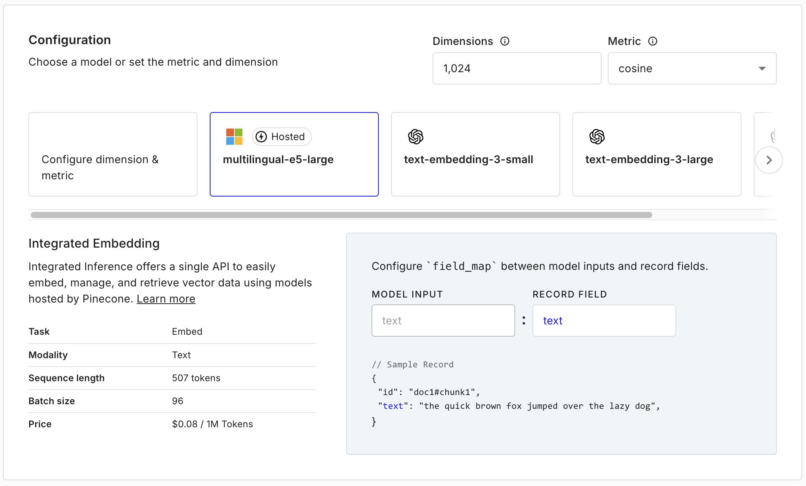

---
title: "Vector Databases: A Traditional Database Developer's Perspective"
date: 2025-01-16T21:00:19+08:00
draft: false

---


# Vector Databases: A Traditional Database Developer's Perspective

As a traditional database developer with machine learning platform experience from my time at Shopee, I've recently been exploring vector databases, particularly Pinecone. Rather than providing a comprehensive technical evaluation, I want to share my thoughts on why vector databases are gaining significant attention and substantial valuations in the funding market.

## Demystifying Vector Databases

At its core, a vector database primarily solves similarity search problems. While traditional search engines like Elasticsearch (in its earlier versions) focused on word-based full-text search with basic tokenization, vector databases take a fundamentally different approach.

Consider searching for "Microsoft Cloud" in a traditional search engine. It might find documents containing "Microsoft" or "Cloud" individually, but it would likely miss relevant content about "Azure" - Microsoft's cloud platform. This limitation stems from the basic word-matching approach of traditional search engines.

## The Truth About Embeddings

One common misconception I've noticed is that vector databases must use Large Language Models (LLMs) for generating embeddings. This misconception has been partly fueled by the recent RAG (Retrieval-Augmented Generation) boom and companies like OpenAI potentially steering users toward their expensive embedding services.



Here's my take away: Production-ready embeddings don't require massive models or expensive GPU infrastructure. For instance, the [multilingual-E5-large model](https://huggingface.co/intfloat/multilingual-e5-large) recommended by Pinecone:
- Has only 24 layers
- Contains about 560 million parameters
- Requires less than 3GB of memory
- Can generate embeddings efficiently on CPU for single queries
- Even supports multiple languages effectively

This means you can achieve production-quality embeddings using modest hardware. While GPUs can speed up batch processing, even an older GPU like the RTX 2060 can handle multilingual embedding generation efficiently.

## The Simplicity of Vector Search

Another interesting observation from my Pinecone experimentation is that many assume vector databases must use sophisticated algorithms like Approximate Nearest Neighbor (ANN) search or advanced disk-based embedding techniques. However, in many practical applications, brute-force search can be surprisingly effective. The basic process is straightforward:

1. Generate embeddings for your corpus in batches
2. Store both the original text and its embedding
3. For queries, generate embeddings using the same model
4. Calculate cosine distances and find the nearest neighbors

## Dimensional Considerations and Cost Implications

An intriguing observation from my Pinecone usage is their default 1024-dimensional vectors. However, my testing revealed that for sequences with 500-1000 tokens, 256 dimensions often provide excellent results even with millions of records. The higher dimensionality, while potentially unnecessary, does impact costs since vector databases typically charge based on usage volume.

## A Vision for Better Vector Databases

As a database developer, I envision a more intuitive vector database design where embeddings are treated as special indices rather than explicit columns. Ideally, it would work like this:

```sql
SELECT * FROM text_table 
  WHERE input_text EMBEDDING_LIKE text
```

Users shouldn't need to interact directly with embeddings. The database should handle embedding generation during insertion and querying, making the vector search feel like a natural extension of traditional database operations.

## Commercial Considerations

Pinecone's partnership model with cloud providers like Azure offers interesting advantages, particularly for enterprise customers. The Azure Marketplace integration enables unified billing, which is a significant benefit for corporate users. Additionally, their getting started experience is well-designed, though users still need a solid understanding of embeddings and vector search to build effective applications.

## Conclusion

Vector databases represent an exciting evolution in search technology, but they don't need to be as complex or resource-intensive as many assume. As the field matures, I hope to see more focus on user-friendly abstractions and cost-effective implementations that make this powerful technology more accessible to developers.

So, how would it be like if there is a library that put a embedding model into chDB? 🤔
