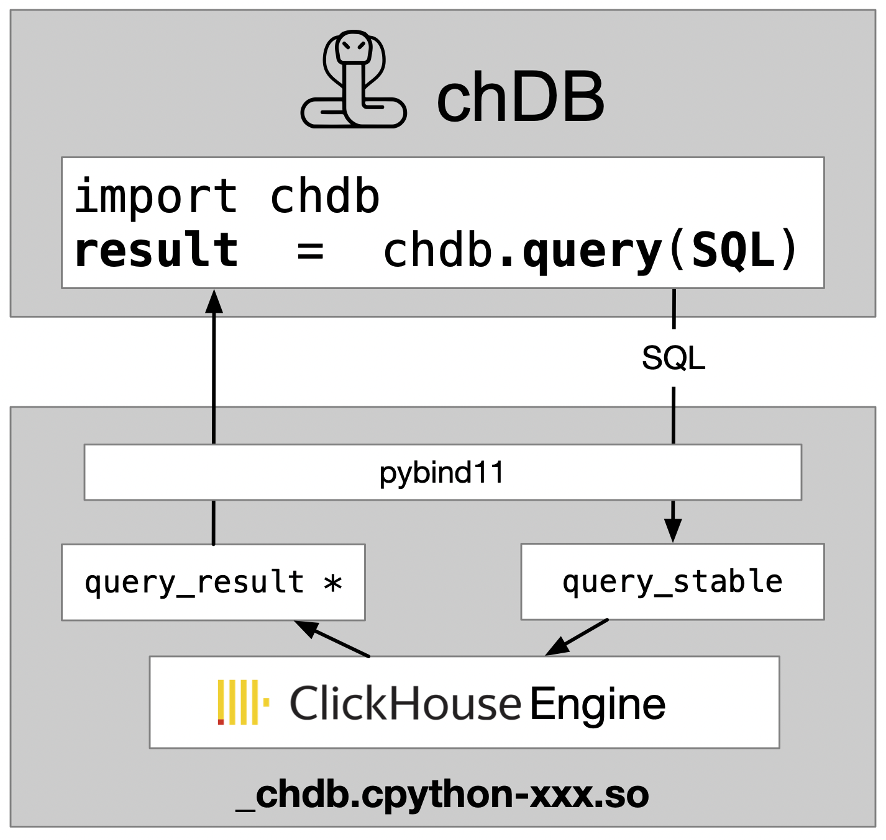
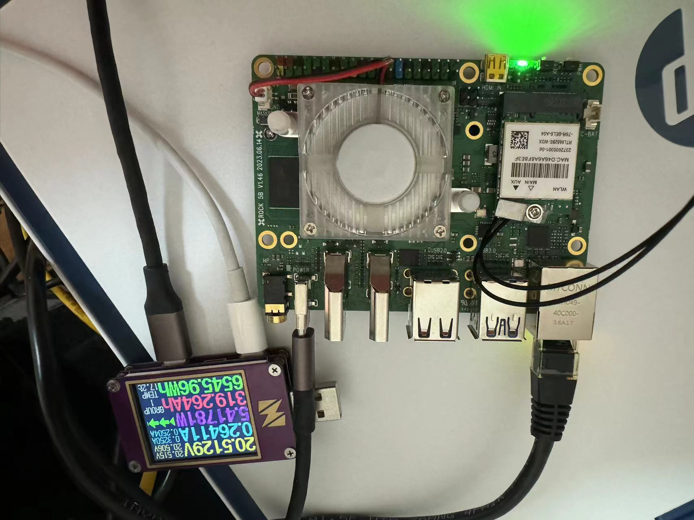
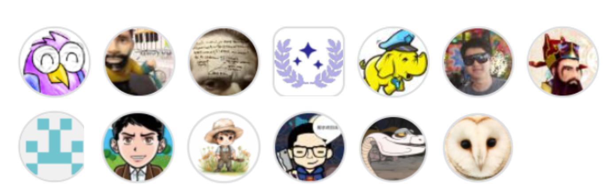
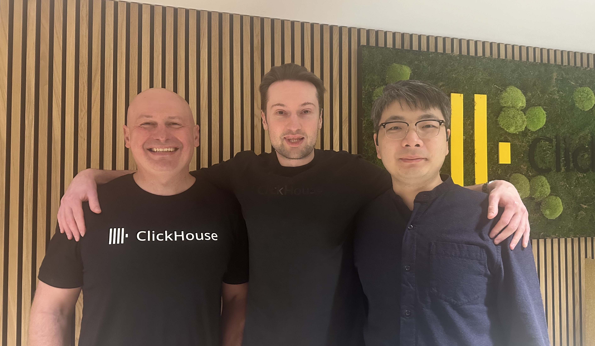

---
title: "chDB is joining ClickHouse"
date: 2024-03-07T21:00:19+08:00
draft: false

---

## The Start

During the Lunar New Year in February last year, in order to solve the efficiency problem of the machine learning model sample data I was facing at the time, I created chDB. Of course, compared to everything that the creators of ClickHouse have done so far, chDB is just a tiny hack on ClickHouse local.

## Running Everywhere

Despite many imperfections, chDB quickly gained a lot of fans in a way that surprised me. They run chDB on Notebook, AWS Lambda, Raspberry Pi, and even Android Phone. I realized that many people are impressed by the amazing performance of ClickHouse, and now people need to use ClickHouse to solve their data problems in almost all possible places.

## Community

ClickHouse's CTO Alexey (my idol) and Product VP Tanya quickly contacted me, and I received a lot of encouragement. ClickHouse is a very friendly and open community, and the official ClickHouse Blog has also introduced chDB many times. chDB has also got many contributors:

ClickHouse, as an engineering product with millions of lines of code, still maintains clear modules and layers. This makes Hacking on ClickHouse very pleasant and efficient. However, C++ still discourages many people. So I created a stable C API based on clickhouse-local and released libchdb. This allows more people to join the development of chDB, resulting in more programming language bindings for chDB.

Currently, chDB not only supports all mainstream versions of Python, but also has support for many programming languages, including C/C++, Golang, Rust, NodeJS, Bun, and .NET. In terms of platforms, chDB supports macOS x86_64, macOS arm64, Linux x86_64, and Linux aarch64.

## Meetup

As chDB is known and adopted by more and more people, although I try my best to promote and improve chDB with contributors in my spare time, and constantly rebase to catch up with the release progress of ClickHouse, the issues are still piling up.

At that time, Yury found me and asked me if I would like to join ClickHouse. In February of this year, under the hospitality of ClickHouse, I came to Amsterdam and met this lovely group of people behind ClickHouse.

## Count me in

My answer is Yes! Nothing is more exciting than doing what you love with your idol. So just this week, I officially became a member of ClickHouse. I will devote myself full-time to the development of chDB, and chDB will also receive continuous and professional improvements.

So, what will chDB do next:

1. Better performance, especially on Pandas DataFrame and Arrow Buffer
2. Keep up with the latest ClickHouse releases
3. Better integration with more programming languages and data sources

Maybe you guys have better ideas. Please tell me on [chDB discussions](https://github.com/orgs/chdb-io/discussions) 😛

For more information about chDB joining ClickHouse, please visit [ClickHouse Blog](https://clickhouse.com/blog/chdb-joins-clickhouse-family)

For more about chDB, please visit [doc.chdb.io](https://doc.chdb.io/)
